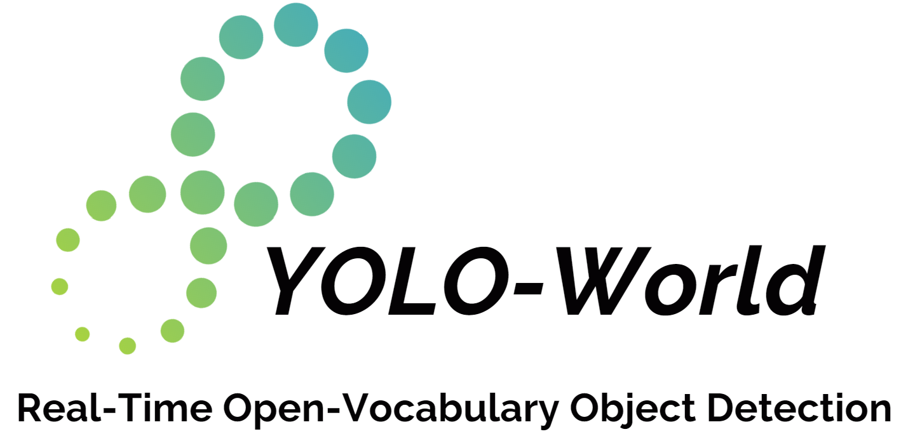
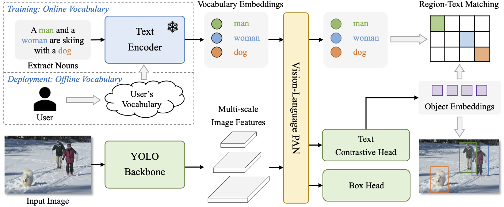

<div align="center">

<br>
<a href="https://scholar.google.com/citations?hl=zh-CN&user=PH8rJHYAAAAJ">Tianheng Cheng</a><sup><span>2,3,*</span></sup>, 
<a href="https://linsong.info/">Lin Song</a><sup><span>1,📧,*</span></sup>,
<a href="https://yxgeee.github.io/">Yixiao Ge</a><sup><span>1,🌟,2</span></sup>,
<a href="http://eic.hust.edu.cn/professor/liuwenyu/"> Wenyu Liu</a><sup><span>3</span></sup>,
<a href="https://xwcv.github.io/">Xinggang Wang</a><sup><span>3,📧</span></sup>,
<a href="https://scholar.google.com/citations?user=4oXBp9UAAAAJ&hl=en">Ying Shan</a><sup><span>1,2</span></sup>
</br>

\* Equal contribution 🌟 Project lead 📧 Corresponding author

<sup>1</sup> Tencent AI Lab,  <sup>2</sup> ARC Lab, Tencent PCG
<sup>3</sup> Huazhong University of Science and Technology
<br>
<div>

[](https://wondervictor.github.io/)
[](https://arxiv.org/abs/2401.17270)
<a href="https://colab.research.google.com/github/AILab-CVC/YOLO-World/blob/master/inference.ipynb"></a>
[](https://huggingface.co/spaces/stevengrove/YOLO-World)
[](https://replicate.com/zsxkib/yolo-world)
[](https://huggingface.co/papers/2401.17270)
[](LICENSE)
[](https://huggingface.co/spaces/SkalskiP/YOLO-World)
[](https://supervision.roboflow.com/develop/notebooks/zero-shot-object-detection-with-yolo-world)
[](https://inference.roboflow.com/foundation/yolo_world/)

</div>
</div>

## Notice

We recommend that everyone **use English to communicate on issues**, as this helps developers from around the world discuss, share experiences, and answer questions together.

## 🔥 Updates 
`[2024-4-28]:` Long time no see! This update contains bugfixs and improvements: (1) ONNX demo; (2) image demo (support tensor input); (2) new pre-trained models; (3) image prompts; (4)simple version for fine-tuning / deployment; (5) guide for installation (include a `requirements.txt`).  
`[2024-3-28]:` We provide: (1) more high-resolution pre-trained models (e.g., S, M, X) ([#142](https://github.com/AILab-CVC/YOLO-World/issues/142)); (2) pre-trained models with CLIP-Large text encoders. Most importantly, we preliminarily fix the **fine-tuning without `mask-refine`** and explore a new fine-tuning setting ([#160](https://github.com/AILab-CVC/YOLO-World/issues/160),[#76](https://github.com/AILab-CVC/YOLO-World/issues/76)). In addition, fine-tuning YOLO-World with `mask-refine` also obtains significant improvements, check more details in [configs/finetune_coco](./configs/finetune_coco/).  
`[2024-3-16]:` We fix the bugs about the demo ([#110](https://github.com/AILab-CVC/YOLO-World/issues/110),[#94](https://github.com/AILab-CVC/YOLO-World/issues/94),[#129](https://github.com/AILab-CVC/YOLO-World/issues/129), [#125](https://github.com/AILab-CVC/YOLO-World/issues/125)) with visualizations of segmentation masks, and release [**YOLO-World with Embeddings**](./docs/prompt_yolo_world.md), which supports prompt tuning, text prompts and image prompts.  
`[2024-3-3]:` We add the **high-resolution YOLO-World**, which supports `1280x1280` resolution with higher accuracy and better performance for small objects!  
`[2024-2-29]:` We release the newest version of [ **YOLO-World-v2**](./docs/updates.md) with higher accuracy and faster speed! We hope the community can join us to improve YOLO-World!  
`[2024-2-28]:` Excited to announce that YOLO-World has been accepted by **CVPR 2024**! We're continuing to make YOLO-World faster and stronger, as well as making it better to use for all.  
`[2024-2-22]:` We sincerely thank [RoboFlow](https://roboflow.com/) and [@Skalskip92](https://twitter.com/skalskip92) for the [**Video Guide**](https://www.youtube.com/watch?v=X7gKBGVz4vs) about YOLO-World, nice work!  
`[2024-2-18]:` We thank [@Skalskip92](https://twitter.com/skalskip92) for developing the wonderful segmentation demo via connecting YOLO-World and EfficientSAM. You can try it now at the [🤗 HuggingFace Spaces](https://huggingface.co/spaces/SkalskiP/YOLO-World).   
`[2024-2-17]:` The largest model **X** of YOLO-World is released, which achieves better zero-shot performance!   
`[2024-2-17]:` We release the code & models for **YOLO-World-Seg** now! YOLO-World now supports open-vocabulary / zero-shot object segmentation!  
`[2024-2-15]:` The pre-traind YOLO-World-L with CC3M-Lite is released!     
`[2024-2-14]:` We provide the [`image_demo`](demo.py) for inference on images or directories.   
`[2024-2-10]:` We provide the [fine-tuning](./docs/finetuning.md) and [data](./docs/data.md) details for fine-tuning YOLO-World on the COCO dataset or the custom datasets!  
`[2024-2-3]:` We support the `Gradio` demo now in the repo and you can build the YOLO-World demo on your own device!  
`[2024-2-1]:` We've released the code and weights of YOLO-World now!  
`[2024-2-1]:` We deploy the YOLO-World demo on [HuggingFace 🤗](https://huggingface.co/spaces/stevengrove/YOLO-World), you can try it now!  
`[2024-1-31]:` We are excited to launch **YOLO-World**, a cutting-edge real-time open-vocabulary object detector.  


## TODO

YOLO-World is under active development and please stay tuned ☕️! 
If you have suggestions📃 or ideas💡,**we would love for you to bring them up in the [Roadmap](https://github.com/AILab-CVC/YOLO-World/issues/109)** ❤️!
> YOLO-World 目前正在积极开发中📃，如果你有建议或者想法💡，**我们非常希望您在 [Roadmap](https://github.com/AILab-CVC/YOLO-World/issues/109) 中提出来** ❤️！

## [FAQ (Frequently Asked Questions)](https://github.com/AILab-CVC/YOLO-World/discussions/149)

We have set up an FAQ about YOLO-World in the discussion on GitHub. We hope everyone can raise issues or solutions during use here, and we also hope that everyone can quickly find solutions from it.

> 我们在GitHub的discussion中建立了关于YOLO-World的常见问答，这里将收集一些常见问题，同时大家可以在此提出使用中的问题或者解决方案，也希望大家能够从中快速寻找到解决方案


## Highlights & Introduction

This repo contains the PyTorch implementation, pre-trained weights, and pre-training/fine-tuning code for YOLO-World.

* YOLO-World is pre-trained on large-scale datasets, including detection, grounding, and image-text datasets.

* YOLO-World is the next-generation YOLO detector, with a strong open-vocabulary detection capability and grounding ability.

* YOLO-World presents a *prompt-then-detect* paradigm for efficient user-vocabulary inference, which re-parameterizes vocabulary embeddings as parameters into the model and achieve superior inference speed. You can try to export your own detection model without extra training or fine-tuning in our [online demo](https://huggingface.co/spaces/stevengrove/YOLO-World)!


<center>

</center>

## Model Zoo

We've pre-trained YOLO-World-S/M/L from scratch and evaluate on the `LVIS val-1.0` and `LVIS minival`. We provide the pre-trained model weights and training logs for applications/research or re-producing the results.

### Zero-shot Inference on LVIS dataset

<div><font size=2>

| model                                                                                                                | Pre-train Data       | Size | AP<sup>mini</su> | AP<sub>r</sub> | AP<sub>c</sub> | AP<sub>f</sub> | AP<sup>val</su> | AP<sub>r</sub> | AP<sub>c</sub> | AP<sub>f</sub> |                                                                                        weights                                                                                         |
| :------------------------------------------------------------------------------------------------------------------- | :------------------- | :----------------- | :--------------: | :------------: | :------------: | :------------: | :-------------: | :------------: | :------------: | :------------: | :------------------------------------------------------------------------------------------------------------------------------------------------------------------------------------: |
| [YOLO-Worldv2-S](./configs/pretrain/yolo_world_v2_s_vlpan_bn_2e-3_100e_4x8gpus_obj365v1_goldg_train_lvis_minival.py) | O365+GoldG | 640 | 22.7 | 16.3 | 20.8 | 25.5 |  17.3 | 11.3 | 14.9 | 22.7 |[HF Checkpoints 🤗](https://huggingface.co/wondervictor/YOLO-World/blob/main/yolo_world_v2_s_obj365v1_goldg_pretrain-55b943ea.pth)|
| [YOLO-Worldv2-S](./configs/pretrain/yolo_world_v2_s_vlpan_bn_2e-3_100e_4x8gpus_obj365v1_goldg_train_1280ft_lvis_minival.py) | O365+GoldG | 1280&#x1F538; | 24.1 | 18.7 | 22.0 | 26.9 |  18.8 | 14.1 | 16.3 | 23.8 |[HF Checkpoints 🤗](https://huggingface.co/wondervictor/YOLO-World/blob/main/yolo_world_v2_s_obj365v1_goldg_pretrain_1280ft-fc4ff4f7.pth)|  
| [YOLO-Worldv2-M](./configs/pretrain/yolo_world_v2_m_vlpan_bn_2e-3_100e_4x8gpus_obj365v1_goldg_train_lvis_minival.py)  | O365+GoldG | 640 | 30.0 | 25.0  | 27.2 | 33.4 | 23.5 | 17.1 | 20.0 | 30.1 | [HF Checkpoints 🤗](https://huggingface.co/wondervictor/YOLO-World/blob/main/yolo_world_v2_m_obj365v1_goldg_pretrain-c6237d5b.pth)| 
| [YOLO-Worldv2-M](./configs/pretrain/yolo_world_v2_m_vlpan_bn_2e-3_100e_4x8gpus_obj365v1_goldg_train_1280ft_lvis_minival.py) | O365+GoldG | 1280&#x1F538; | 31.6 | 24.5  | 29.0 | 35.1 | 25.3 | 19.3 | 22.0 | 31.7 | [HF Checkpoints 🤗](https://huggingface.co/wondervictor/YOLO-World/blob/main/yolo_world_v2_m_obj365v1_goldg_pretrain_1280ft-77d0346d.pth)| 
| [YOLO-Worldv2-L](./configs/pretrain/yolo_world_v2_l_vlpan_bn_2e-3_100e_4x8gpus_obj365v1_goldg_train_lvis_minival.py) | O365+GoldG | 640 | 33.0 | 22.6 | 32.0 | 35.8 | 26.0 | 18.6 | 23.0 | 32.6 | [HF Checkpoints 🤗](https://huggingface.co/wondervictor/YOLO-World/blob/main/yolo_world_v2_l_obj365v1_goldg_pretrain-a82b1fe3.pth)| 
| [YOLO-Worldv2-L](./configs/pretrain/yolo_world_v2_l_vlpan_bn_2e-3_100e_4x8gpus_obj365v1_goldg_train_1280ft_lvis_minival.py) | O365+GoldG | 1280&#x1F538; | 34.6 | 29.2 | 32.8 | 37.2 | 27.6 | 21.9 | 24.2 | 34.0 | [HF Checkpoints 🤗](https://huggingface.co/wondervictor/YOLO-World/blob/main/yolo_world_v2_l_obj365v1_goldg_pretrain_1280ft-9babe3f6.pth)| 
| [YOLO-Worldv2-L (CLIP-Large)](./configs/pretrain/yolo_world_v2_l_clip_large_vlpan_bn_2e-3_100e_4x8gpus_obj365v1_goldg_train_lvis_minival.py) 🔥  | O365+GoldG | 640 | 34.0 | 22.0 | 32.6 | 37.4 | 27.1 | 19.9 | 23.9 | 33.9 | [HF Checkpoints 🤗](https://huggingface.co/wondervictor/YOLO-World/blob/main/yolo_world_v2_l_clip_large_o365v1_goldg_pretrain-8ff2e744.pth)|
| [YOLO-Worldv2-L (CLIP-Large)](./configs/pretrain/yolo_world_v2_l_clip_large_vlpan_bn_2e-3_100e_4x8gpus_obj365v1_goldg_train_800ft_lvis_minival.py) 🔥  | O365+GoldG | 800&#x1F538; | 35.5 | 28.3 | 33.2 | 38.8 | 28.6 | 22.0 | 25.1 | 35.4 | [HF Checkpoints 🤗](https://huggingface.co/wondervictor/YOLO-World/blob/main/yolo_world_v2_l_clip_large_o365v1_goldg_pretrain_800ft-9df82e55.pth)|
| [YOLO-Worldv2-L](./configs/pretrain/yolo_world_v2_l_vlpan_bn_2e-3_100e_4x8gpus_obj365v1_goldg_train_lvis_minival.py) | O365+GoldG+CC3M-Lite | 640 | 32.9 | 25.3 | 31.1 | 35.8 | 26.1 | 20.6 | 22.6 | 32.3 | [HF Checkpoints 🤗](https://huggingface.co/wondervictor/YOLO-World/blob/main/yolo_world_v2_l_obj365v1_goldg_cc3mlite_pretrain-ca93cd1f.pth)|
| [YOLO-Worldv2-X](./configs/pretrain/yolo_world_v2_x_vlpan_bn_2e-3_100e_4x8gpus_obj365v1_goldg_train_lvis_minival.py) | O365+GoldG+CC3M-Lite | 640 | 35.4 | 28.7 | 32.9 | 38.7 | 28.4 | 20.6 | 25.6 | 35.0 | [HF Checkpoints 🤗](https://huggingface.co/wondervictor/YOLO-World/blob/main/yolo_world_v2_x_obj365v1_goldg_cc3mlite_pretrain-8698fbfa.pth) |
| 🔥 [YOLO-Worldv2-X]() |  O365+GoldG+CC3M-Lite | 1280&#x1F538; | 37.4 | 30.5 | 35.2 | 40.7  | 29.8 | 21.1 | 26.8 | 37.0 | [HF Checkpoints 🤗](https://huggingface.co/wondervictor/YOLO-World/blob/main/yolo_world_v2_x_obj365v1_goldg_cc3mlite_pretrain_1280ft-14996a36.pth) |
| [YOLO-Worldv2-XL](./configs/pretrain/yolo_world_v2_xl_vlpan_bn_2e-3_100e_4x8gpus_obj365v1_goldg_train_lvis_minival.py) | O365+GoldG+CC3M-Lite | 640 | 36.0 | 25.8 | 34.1 | 39.5 | 29.1 | 21.1 | 26.3 | 35.8 | [HF Checkpoints 🤗](https://huggingface.co/wondervictor/YOLO-World/blob/main/yolo_world_v2_xl_obj365v1_goldg_cc3mlite_pretrain-5daf1395.pth) |

</font>
</div>

**NOTE:**
1. AP<sup>mini</sup>: evaluated on LVIS `minival`.
3. AP<sup>val</sup>: evaluated on LVIS `val 1.0`.
4. [HuggingFace Mirror](https://hf-mirror.com/) provides the mirror of HuggingFace, which is a choice for users who are unable to reach.
5. &#x1F538;: fine-tuning models with the pre-trained data.

**Pre-training Logs:**

We provide the pre-training logs of `YOLO-World-v2`. Due to the unexpected errors of the local machines, the training might be interrupted several times.

| Model | YOLO-World-v2-S | YOLO-World-v2-M  | YOLO-World-v2-L | YOLO-World-v2-X |
| :---  | :-------------: | :--------------: | :-------------: | :-------------: |
|Pre-training Log | [Part-1](https://drive.google.com/file/d/1oib7pKfA2h1U_5-85H_s0Nz8jWd0R-WP/view?usp=drive_link), [Part-2](https://drive.google.com/file/d/11cZ6OZy80VTvBlZy3kzLAHCxx5Iix5-n/view?usp=drive_link) | [Part-1](https://drive.google.com/file/d/1E6vYSS8kBipGc8oQnsjAfeUAx8I9yOX7/view?usp=drive_link), [Part-2](https://drive.google.com/file/d/1fbM7vt2tgSeB8o_7tUDofWvpPNSViNj5/view?usp=drive_link) | [Part-1](https://drive.google.com/file/d/1Tola1QGJZTL6nGy3SBxKuknfNfREDm8J/view?usp=drive_link), [Part-2](https://drive.google.com/file/d/1mTBXniioUb0CdctCG4ckIU6idGo0NnH8/view?usp=drive_link) |  [Final part](https://drive.google.com/file/d/1aEUA_EPQbXOrpxHTQYB6ieGXudb1PLpd/view?usp=drive_link)| 


## Getting started

### 1. Installation

YOLO-World is developed based on `torch==1.11.0` `mmyolo==0.6.0` and `mmdetection==3.0.0`. Check more details about `requirements` and `mmcv` in [docs/installation](./docs/installation.md).

#### Clone Project 

```bash
git clone --recursive https://github.com/AILab-CVC/YOLO-World.git
```
#### Install

```bash
pip install torch wheel -q
pip install -e .
```

### 2. Preparing Data

We provide the details about the pre-training data in [docs/data](./docs/data.md).


## Training & Evaluation

We adopt the default [training](./tools/train.py) or [evaluation](./tools/test.py) scripts of [mmyolo](https://github.com/open-mmlab/mmyolo).
We provide the configs for pre-training and fine-tuning in `configs/pretrain` and `configs/finetune_coco`.
Training YOLO-World is easy:

```bash
chmod +x tools/dist_train.sh
# sample command for pre-training, use AMP for mixed-precision training
./tools/dist_train.sh configs/pretrain/yolo_world_l_t2i_bn_2e-4_100e_4x8gpus_obj365v1_goldg_train_lvis_minival.py 8 --amp
```
**NOTE:** YOLO-World is pre-trained on 4 nodes with 8 GPUs per node (32 GPUs in total). For pre-training, the `node_rank` and `nnodes` for multi-node training should be specified. 

Evaluating YOLO-World is also easy:

```bash
chmod +x tools/dist_test.sh
./tools/dist_test.sh path/to/config path/to/weights 8
```

**NOTE:** We mainly evaluate the performance on LVIS-minival for pre-training.

## Fine-tuning YOLO-World

We provide the details about fine-tuning YOLO-World in [docs/fine-tuning](./docs/finetuning.md).

## Deployment

We provide the details about deployment for downstream applications in [docs/deployment](./docs/deploy.md).
You can directly download the ONNX model through the online [demo](https://huggingface.co/spaces/stevengrove/YOLO-World) in Huggingface Spaces 🤗.

## Demo

See [`demo`](./demo) for more details

- [x] `gradio_demo.py`: Gradio demo, ONNX export
- [x] `image_demo.py`: inference with images or a directory of images
- [x] `simple_demo.py`: a simple demo of YOLO-World, using `array` (instead of path as input).
- [x] `video_demo.py`: inference YOLO-World on videos.
- [x] `inference.ipynb`: jupyter notebook for YOLO-World.
- [x] [Google Colab Notebook](https://colab.research.google.com/drive/1F_7S5lSaFM06irBCZqjhbN7MpUXo6WwO?usp=sharing): We sincerely thank [Onuralp](https://github.com/onuralpszr) for sharing the [Colab Demo](https://colab.research.google.com/drive/1F_7S5lSaFM06irBCZqjhbN7MpUXo6WwO?usp=sharing), you can have a try 😊！

## Acknowledgement

We sincerely thank [mmyolo](https://github.com/open-mmlab/mmyolo), [mmdetection](https://github.com/open-mmlab/mmdetection), [GLIP](https://github.com/microsoft/GLIP), and [transformers](https://github.com/huggingface/transformers) for providing their wonderful code to the community!

## Citations
If you find YOLO-World is useful in your research or applications, please consider giving us a star 🌟 and citing it.

```bibtex
@inproceedings{Cheng2024YOLOWorld,
  title={YOLO-World: Real-Time Open-Vocabulary Object Detection},
  author={Cheng, Tianheng and Song, Lin and Ge, Yixiao and Liu, Wenyu and Wang, Xinggang and Shan, Ying},
  booktitle={Proc. IEEE Conf. Computer Vision and Pattern Recognition (CVPR)},
  year={2024}
}
```

## Licence
YOLO-World is under the GPL-v3 Licence and is supported for comercial usage.
