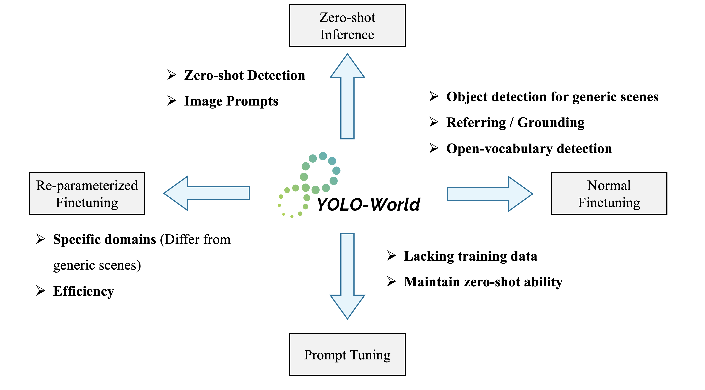

<div align="center">

<br>
<a href="https://scholar.google.com/citations?hl=zh-CN&user=PH8rJHYAAAAJ">Tianheng Cheng</a><sup><span>2,3,*</span></sup>, 
<a href="https://linsong.info/">Lin Song</a><sup><span>1,📧,*</span></sup>,
<a href="https://yxgeee.github.io/">Yixiao Ge</a><sup><span>1,🌟,2</span></sup>,
<a href="http://eic.hust.edu.cn/professor/liuwenyu/"> Wenyu Liu</a><sup><span>3</span></sup>,
<a href="https://xwcv.github.io/">Xinggang Wang</a><sup><span>3,📧</span></sup>,
<a href="https://scholar.google.com/citations?user=4oXBp9UAAAAJ&hl=en">Ying Shan</a><sup><span>1,2</span></sup>
</br>

\* Equal contribution 🌟 Project lead 📧 Corresponding author

<sup>1</sup> Tencent AI Lab,  <sup>2</sup> ARC Lab, Tencent PCG
<sup>3</sup> Huazhong University of Science and Technology
<br>
<div>

[](https://wondervictor.github.io/)
[](https://arxiv.org/abs/2401.17270)
<a href="https://colab.research.google.com/github/AILab-CVC/YOLO-World/blob/master/inference.ipynb"></a>
[](https://huggingface.co/spaces/stevengrove/YOLO-World)
[](https://replicate.com/zsxkib/yolo-world)
[](https://huggingface.co/papers/2401.17270)
[](LICENSE)
[](https://huggingface.co/spaces/SkalskiP/YOLO-World)
[](https://supervision.roboflow.com/develop/notebooks/zero-shot-object-detection-with-yolo-world)
[](https://inference.roboflow.com/foundation/yolo_world/)

</div>
</div>

## Notice

**YOLO-World is still under active development!**

We recommend that everyone **use English to communicate on issues**, as this helps developers from around the world discuss, share experiences, and answer questions together.

For business licensing and other related inquiries, don't hesitate to contact `yixiaoge@tencent.com`.

## 🔥 Updates 
`[2025-2-8]:` We release a new YOLO-World-V2.1, which includes new pre-trained weights and training code for image prompts. Please see the update [YOLO-World-V2.1-Blog](./docs/update_20250123.md) for details.\
`[2024-11-5]`: We update the `YOLO-World-Image` and you can try it at HuggingFace [YOLO-World-Image (Preview Version)](https://huggingface.co/spaces/wondervictor/YOLO-World-Image). It's a *preview* version and we are still improving it! Detailed documents about training and few-shot inference are coming soon.\
`[2024-7-8]`: YOLO-World now has been integrated into [ComfyUI](https://github.com/StevenGrove/ComfyUI-YOLOWorld)! Come and try adding YOLO-World to your workflow now! You can access it at [StevenGrove/ComfyUI-YOLOWorld](https://github.com/StevenGrove/ComfyUI-YOLOWorld)!  
`[2024-5-18]:` YOLO-World models have been [integrated with the FiftyOne computer vision toolkit](https://docs.voxel51.com/integrations/ultralytics.html#open-vocabulary-detection) for streamlined open-vocabulary inference across image and video datasets.  
`[2024-5-16]:` Hey guys! Long time no see! This update contains (1) [fine-tuning guide](https://github.com/AILab-CVC/YOLO-World?#highlights--introduction) and (2) [TFLite Export](./docs/tflite_deploy.md) with INT8 Quantization.  
`[2024-5-9]:` This update contains the real [`reparameterization`](./docs/reparameterize.md) 🪄, and it's better for fine-tuning on custom datasets and improves the training/inference efficiency 🚀!  
`[2024-4-28]:` Long time no see! This update contains bugfixs and improvements: (1) ONNX demo; (2) image demo (support tensor input); (2) new pre-trained models; (3) image prompts; (4) simple version for fine-tuning / deployment; (5) guide for installation (include a `requirements.txt`).  
`[2024-3-28]:` We provide: (1) more high-resolution pre-trained models (e.g., S, M, X) ([#142](https://github.com/AILab-CVC/YOLO-World/issues/142)); (2) pre-trained models with CLIP-Large text encoders. Most importantly, we preliminarily fix the **fine-tuning without `mask-refine`** and explore a new fine-tuning setting ([#160](https://github.com/AILab-CVC/YOLO-World/issues/160),[#76](https://github.com/AILab-CVC/YOLO-World/issues/76)). In addition, fine-tuning YOLO-World with `mask-refine` also obtains significant improvements, check more details in [configs/finetune_coco](./configs/finetune_coco/).  
`[2024-3-16]:` We fix the bugs about the demo ([#110](https://github.com/AILab-CVC/YOLO-World/issues/110),[#94](https://github.com/AILab-CVC/YOLO-World/issues/94),[#129](https://github.com/AILab-CVC/YOLO-World/issues/129), [#125](https://github.com/AILab-CVC/YOLO-World/issues/125)) with visualizations of segmentation masks, and release [**YOLO-World with Embeddings**](./docs/prompt_yolo_world.md), which supports prompt tuning, text prompts and image prompts.  
`[2024-3-3]:` We add the **high-resolution YOLO-World**, which supports `1280x1280` resolution with higher accuracy and better performance for small objects!  
`[2024-2-29]:` We release the newest version of [ **YOLO-World-v2**](./docs/updates.md) with higher accuracy and faster speed! We hope the community can join us to improve YOLO-World!  
`[2024-2-28]:` Excited to announce that YOLO-World has been accepted by **CVPR 2024**! We're continuing to make YOLO-World faster and stronger, as well as making it better to use for all.  
`[2024-2-22]:` We sincerely thank [RoboFlow](https://roboflow.com/) and [@Skalskip92](https://twitter.com/skalskip92) for the [**Video Guide**](https://www.youtube.com/watch?v=X7gKBGVz4vs) about YOLO-World, nice work!  
`[2024-2-18]:` We thank [@Skalskip92](https://twitter.com/skalskip92) for developing the wonderful segmentation demo via connecting YOLO-World and EfficientSAM. You can try it now at the [🤗 HuggingFace Spaces](https://huggingface.co/spaces/SkalskiP/YOLO-World).   
`[2024-2-17]:` The largest model **X** of YOLO-World is released, which achieves better zero-shot performance!   
`[2024-2-17]:` We release the code & models for **YOLO-World-Seg** now! YOLO-World now supports open-vocabulary / zero-shot object segmentation!  
`[2024-2-15]:` The pre-traind YOLO-World-L with CC3M-Lite is released!     
`[2024-2-14]:` We provide the [`image_demo`](demo.py) for inference on images or directories.   
`[2024-2-10]:` We provide the [fine-tuning](./docs/finetuning.md) and [data](./docs/data.md) details for fine-tuning YOLO-World on the COCO dataset or the custom datasets!  
`[2024-2-3]:` We support the `Gradio` demo now in the repo and you can build the YOLO-World demo on your own device!  
`[2024-2-1]:` We've released the code and weights of YOLO-World now!  
`[2024-2-1]:` We deploy the YOLO-World demo on [HuggingFace 🤗](https://huggingface.co/spaces/stevengrove/YOLO-World), you can try it now!  
`[2024-1-31]:` We are excited to launch **YOLO-World**, a cutting-edge real-time open-vocabulary object detector.  


## TODO

YOLO-World is under active development and please stay tuned ☕️! 
If you have suggestions📃 or ideas💡,**we would love for you to bring them up in the [Roadmap](https://github.com/AILab-CVC/YOLO-World/issues/109)** ❤️!
> YOLO-World 目前正在积极开发中📃，如果你有建议或者想法💡，**我们非常希望您在 [Roadmap](https://github.com/AILab-CVC/YOLO-World/issues/109) 中提出来** ❤️！

## [FAQ (Frequently Asked Questions)](https://github.com/AILab-CVC/YOLO-World/discussions/149)

We have set up an FAQ about YOLO-World in the discussion on GitHub. We hope everyone can raise issues or solutions during use here, and we also hope that everyone can quickly find solutions from it.

> 我们在GitHub的discussion中建立了关于YOLO-World的常见问答，这里将收集一些常见问题，同时大家可以在此提出使用中的问题或者解决方案，也希望大家能够从中快速寻找到解决方案


## Highlights & Introduction

This repo contains the PyTorch implementation, pre-trained weights, and pre-training/fine-tuning code for YOLO-World.

* YOLO-World is pre-trained on large-scale datasets, including detection, grounding, and image-text datasets.

* YOLO-World is the next-generation YOLO detector, with a strong open-vocabulary detection capability and grounding ability.

* YOLO-World presents a *prompt-then-detect* paradigm for efficient user-vocabulary inference, which re-parameterizes vocabulary embeddings as parameters into the model and achieve superior inference speed. You can try to export your own detection model without extra training or fine-tuning in our [online demo](https://huggingface.co/spaces/stevengrove/YOLO-World)!


<div align="center">

</div>

### Zero-shot Evaluation Results for Pre-trained Models
We evaluate all YOLO-World-V2.1 models on LVIS, LVIS-mini, and COCO in the zero-shot manner, and compare with the previous version (the improvements are annotated in the superscripts).

<table>
    <tr>
        <th rowspan="2">Model</th><th rowspan="2">Resolution</th><th colspan="4" style="border-right: 1px solid">LVIS AP</th><th colspan="4">LVIS-mini</th><th colspan="4" style="border-left: 1px solid">COCO</th>
    </tr>
        <td>AP</td><td>AP<sub>r</sub></td><td>AP<sub>c</sub></td><td style="border-right: 1px solid">AP<sub>f</sub></td><td>AP</td><td>AP<sub>r</sub></td><td>AP<sub>c</sub></td><td>AP<sub>f</sub></td><td style="border-left: 1px solid">AP</td><td>AP<sub>50</sub></td><td>AP<sub>75</sub></td>
    <tr style="border-top: 2px solid">
        <td>YOLO-World-S</td><td>640</td><td>18.5<sup>+1.2</sup></td><td>12.6</td><td>15.8</td><td style="border-right: 1px solid">24.1</td><td>23.6<sup>+0.9</sup></td><td>16.4</td><td>21.5</td><td>26.6</td><td style="border-left: 1px solid">36.6</td><td>51.0</td><td>39.7</td>
    </tr>
    <tr>
        <td>YOLO-World-S</td><td>1280</td><td>19.7<sup>+0.9</sup></td><td>13.5</td><td>16.3</td><td style="border-right: 1px solid">26.3</td><td>25.5<sup>+1.4</sup></td><td>19.1</td><td>22.6</td><td>29.3</td><td style="border-left: 1px solid">38.2</td><td>54.2</td><td>41.6</td>
    </tr>
    <tr style="border-top: 2px solid">
        <td>YOLO-World-M</td><td>640</td><td>24.1<sup>+0.6</sup></td><td>16.9</td><td>21.1</td><td style="border-right: 1px solid">30.6</td><td>30.6<sup>+0.6</sup></td><td>19.7</td><td>29.0</td><td>34.1</td><td style="border-left: 1px solid">43.0</td><td>58.6</td><td>46.7</td>
    </tr>
    <tr>
        <td>YOLO-World-M</td><td>1280</td><td>26.0<sup>+0.7</sup></td><td>19.9</td><td>22.5</td><td style="border-right: 1px solid">32.7</td><td>32.7<sup>+1.1</sup></td><td>24.4</td><td>30.2</td><td>36.4</td><td style="border-left: 1px solid">43.8</td><td>60.3</td><td>47.7</td>
    </tr>
    <tr style="border-top: 2px solid">
        <td>YOLO-World-L</td><td>640</td><td>26.8<sup>+0.7</sup></td><td>19.8</td><td>23.6</td><td style="border-right: 1px solid">33.4</td><td>33.8<sup>+0.9</sup></td><td>24.5</td><td>32.3</td><td>36.8</td><td style="border-left: 1px solid">44.9</td><td>60.4</td><td>48.9</td>
    </tr>
    <tr>
        <td>YOLO-World-L</td><td>800</td><td>28.3</td><td>22.5</td><td>24.4</td><td style="border-right: 1px solid">35.1</td><td>35.2</td><td>27.8</td><td>32.6</td><td>38.8</td><td style="border-left: 1px solid">47.4</td><td>63.3</td><td>51.8</td>
    </tr>
    <tr>
        <td>YOLO-World-L</td><td>1280</td><td>28.7<sup>+1.1</sup></td><td>22.9</td><td>24.9</td><td style="border-right: 1px solid">35.4</td><td>35.5<sup>+1.2</sup></td><td>24.4</td><td>34.0</td><td>38.8</td><td style="border-left: 1px solid">46.0</td><td>62.5</td><td>50.0</td>
    </tr>
    <tr style="border-top: 2px solid">
        <td>YOLO-World-X</td><td>640</td><td>28.6<sup>+0.2</sup></td><td>22.0</td><td>25.6</td><td style="border-right: 1px solid">34.9</td><td>35.8<sup>+0.4</sup></td><td>31.0</td><td>33.7</td><td>38.5</td><td style="border-left: 1px solid">46.7</td><td>62.5</td><td>51.0</td>
    </tr>
    <tr>
        <td colspan="13">YOLO-World-X-1280 is coming soon.</td>
    </tr>
</table>

### Model Card

<table>
    <tr>
        <th>Model</th><th>Resolution</th><th>Training</th><th>Data</th><th>Model Weights</th>
    </tr>
    <tr style="border-top: 2px solid">
        <td>YOLO-World-S</td><td>640</td><td>PT (100e)</td><td>O365v1+GoldG+CC-LiteV2</td><td><a href="https://huggingface.co/wondervictor/YOLO-World-V2.1/resolve/main/x_stage1-62b674ad.pth"> 🤗 HuggingFace</a></td>
    </tr>
    <tr>
        <td>YOLO-World-S</td><td>1280</td><td>CPT (40e)</td><td>O365v1+GoldG+CC-LiteV2</td><td><a href="https://huggingface.co/wondervictor/YOLO-World-V2.1/resolve/main/s_stage2-4466ab94.pth"> 🤗 HuggingFace</a></td>
    </tr>
    <tr style="border-top: 2px solid">
        <td>YOLO-World-M</td><td>640</td><td>PT (100e)</td><td>O365v1+GoldG+CC-LiteV2</td><td><a href="https://huggingface.co/wondervictor/YOLO-World-V2.1/resolve/main/m_stage1-7e1e5299.pth"> 🤗 HuggingFace</a></td>
    </tr>
    <tr>
        <td>YOLO-World-M</td><td>1280</td><td>CPT (40e)</td><td>O365v1+GoldG+CC-LiteV2</td><td><a href="https://huggingface.co/wondervictor/YOLO-World-V2.1/resolve/main/m_stage2-9987dcb1.pth"> 🤗 HuggingFace</a></td>
    </tr>
    <tr style="border-top: 2px solid">
        <td>YOLO-World-L</td><td>640</td><td>PT (100e)</td><td>O365v1+GoldG+CC-LiteV2</td><td><a href="https://huggingface.co/wondervictor/YOLO-World-V2.1/resolve/main/l_stage1-7d280586.pth"> 🤗 HuggingFace</a></td>
    </tr>
    <tr>
        <td>YOLO-World-L</td><td>800 / 1280</td><td>CPT (40e)</td><td>O365v1+GoldG+CC-LiteV2</td><td><a href="https://huggingface.co/wondervictor/YOLO-World-V2.1/resolve/main/l_stage2-b3e3dc3f.pth"> 🤗 HuggingFace</a></td>
    </tr>
    <tr style="border-top: 2px solid">
        <td>YOLO-World-X</td><td>640</td><td>PT (100e)</td><td>O365v1+GoldG+CC-LiteV2</td><td><a href="https://huggingface.co/wondervictor/YOLO-World-V2.1/resolve/main/x_stage1-62b674ad.pth"> 🤗 HuggingFace</a></td>
    </tr>
</table>

**Notes:**
* PT: Pre-training, CPT: continuing pre-training
* CC-LiteV2: the newly-annotated CC3M subset, including 250k images.


## Getting started

### 1. Installation

YOLO-World is developed based on `torch==1.11.0` `mmyolo==0.6.0` and `mmdetection==3.0.0`. Check more details about `requirements` and `mmcv` in [docs/installation](./docs/installation.md).

#### Clone Project 

```bash
git clone --recursive https://github.com/AILab-CVC/YOLO-World.git
```
#### Install

```bash
pip install torch wheel -q
pip install -e .
```

### 2. Preparing Data

We provide the details about the pre-training data in [docs/data](./docs/data.md).


## Training & Evaluation

We adopt the default [training](./tools/train.py) or [evaluation](./tools/test.py) scripts of [mmyolo](https://github.com/open-mmlab/mmyolo).
We provide the configs for pre-training and fine-tuning in `configs/pretrain` and `configs/finetune_coco`.
Training YOLO-World is easy:

```bash
chmod +x tools/dist_train.sh
# sample command for pre-training, use AMP for mixed-precision training
./tools/dist_train.sh configs/pretrain/yolo_world_l_t2i_bn_2e-4_100e_4x8gpus_obj365v1_goldg_train_lvis_minival.py 8 --amp
```
**NOTE:** YOLO-World is pre-trained on 4 nodes with 8 GPUs per node (32 GPUs in total). For pre-training, the `node_rank` and `nnodes` for multi-node training should be specified. 

Evaluating YOLO-World is also easy:

```bash
chmod +x tools/dist_test.sh
./tools/dist_test.sh path/to/config path/to/weights 8
```

**NOTE:** We mainly evaluate the performance on LVIS-minival for pre-training.

## Fine-tuning YOLO-World

<div align="center">

</div>


<div align="center">
<b><p>Chose your pre-trained YOLO-World and Fine-tune it!</p></b> 
</div>


YOLO-World supports **zero-shot inference**, and three types of **fine-tuning recipes**: **(1) normal fine-tuning**, **(2) prompt tuning**, and **(3) reparameterized fine-tuning**.

* Normal Fine-tuning: we provide the details about fine-tuning YOLO-World in [docs/fine-tuning](./docs/finetuning.md).

* Prompt Tuning: we provide more details ahout prompt tuning in [docs/prompt_yolo_world](./docs/prompt_yolo_world.md).

* Reparameterized Fine-tuning: the reparameterized YOLO-World is more suitable for specific domains far from generic scenes. You can find more details in [docs/reparameterize](./docs/reparameterize.md).

## Deployment

We provide the details about deployment for downstream applications in [docs/deployment](./docs/deploy.md).
You can directly download the ONNX model through the online [demo](https://huggingface.co/spaces/stevengrove/YOLO-World) in Huggingface Spaces 🤗.

- [x] ONNX export and demo: [docs/deploy](https://github.com/AILab-CVC/YOLO-World/blob/master/docs/deploy.md)
- [x] TFLite and INT8 Quantization: [docs/tflite_deploy](https://github.com/AILab-CVC/YOLO-World/blob/master/docs/tflite_deploy.md)
- [ ] TensorRT: coming soon.
- [ ] C++: coming soon.

## Demo

See [`demo`](./demo) for more details

- [x] `gradio_demo.py`: Gradio demo, ONNX export
- [x] `image_demo.py`: inference with images or a directory of images
- [x] `simple_demo.py`: a simple demo of YOLO-World, using `array` (instead of path as input).
- [x] `video_demo.py`: inference YOLO-World on videos.
- [x] `inference.ipynb`: jupyter notebook for YOLO-World.
- [x] [Google Colab Notebook](https://colab.research.google.com/drive/1F_7S5lSaFM06irBCZqjhbN7MpUXo6WwO?usp=sharing): We sincerely thank [Onuralp](https://github.com/onuralpszr) for sharing the [Colab Demo](https://colab.research.google.com/drive/1F_7S5lSaFM06irBCZqjhbN7MpUXo6WwO?usp=sharing), you can have a try 😊！

## Acknowledgement

We sincerely thank [mmyolo](https://github.com/open-mmlab/mmyolo), [mmdetection](https://github.com/open-mmlab/mmdetection), [GLIP](https://github.com/microsoft/GLIP), and [transformers](https://github.com/huggingface/transformers) for providing their wonderful code to the community!

## Citations
If you find YOLO-World is useful in your research or applications, please consider giving us a star 🌟 and citing it.

```bibtex
@inproceedings{Cheng2024YOLOWorld,
  title={YOLO-World: Real-Time Open-Vocabulary Object Detection},
  author={Cheng, Tianheng and Song, Lin and Ge, Yixiao and Liu, Wenyu and Wang, Xinggang and Shan, Ying},
  booktitle={Proc. IEEE Conf. Computer Vision and Pattern Recognition (CVPR)},
  year={2024}
}
```

## Licence
YOLO-World is under the GPL-v3 Licence and is supported for commercial usage. If you need a commercial license for YOLO-World, please feel free to contact us.
