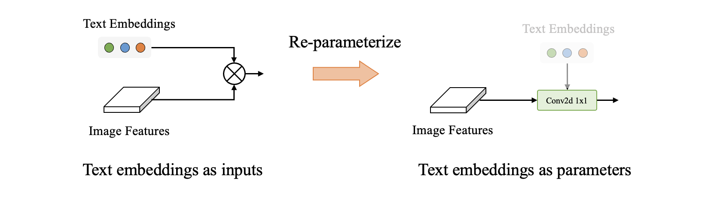

## Reparameterize YOLO-World

The reparameterization incorporates text embeddings as parameters into the model. For example, in the final classification layer, text embeddings are reparameterized into a simple 1x1 convolutional layer.

<div align="center">

</div>

### Key Advantages from Reparameterization

> Reparameterized YOLO-World still has zero-shot ability!

* **Efficiency:** reparameterized YOLO-World has a simple and efficient archtecture, e.g., `conv1x1` is faster than `transpose & matmul`. In addition, it enables further optmization for deployment.
 
* **Accuracy:** reparameterized YOLO-World supports fine-tuning. Compared to the normal `fine-tuning` or `prompt tuning`, **reparameterized version can optimize the `neck` and `head` independently** since the `neck` and `head` have different parameters and do not depend on `text embeddings` anymore!
For example, fine-tuning the **reparameterized YOLO-World** obtains *46.3 AP* on COCO *val2017* while fine-tuning the normal version obtains *46.1 AP*, with all hyper-parameters kept the same.

### Getting Started

#### 1. Prepare cutstom text embeddings

You need to generate the text embeddings by [`toos/generate_text_prompts.py`](../tools/generate_text_prompts.py) and save it as a `numpy.array` with shape `NxD`.

#### 2. Reparameterizing

Reparameterizing will generate a new checkpoint with text embeddings!

Check those files first:

* model checkpoint
* text embeddings

We mainly reparameterize two groups of modules:

* head (`YOLOWorldHeadModule`)
* neck (`MaxSigmoidCSPLayerWithTwoConv`)

```bash
python tools/reparameterize_yoloworld.py \
    --model path/to/checkpoint \
    --out-dir path/to/save/re-parameterized/ \
    --text-embed path/to/text/embeddings \
    --conv-neck
```


#### 3. Prepare the model config

Please see the sample config: [`finetune_coco/yolo_world_v2_s_rep_vlpan_bn_2e-4_80e_8gpus_mask-refine_finetune_coco.py`](../configs/finetune_coco/yolo_world_v2_s_rep_vlpan_bn_2e-4_80e_8gpus_mask-refine_finetune_coco.py) for reparameterized training.


* `RepConvMaxSigmoidCSPLayerWithTwoConv`:

```python
neck=dict(type='YOLOWorldPAFPN',
        guide_channels=num_classes,
        embed_channels=neck_embed_channels,
        num_heads=neck_num_heads,
        block_cfg=dict(type='RepConvMaxSigmoidCSPLayerWithTwoConv',
                        guide_channels=num_classes)),
```

* `RepYOLOWorldHeadModule`:

```python
bbox_head=dict(head_module=dict(type='RepYOLOWorldHeadModule',
                                embed_dims=text_channels,
                                num_guide=num_classes,
                                num_classes=num_classes)),

```

#### 4. Reparameterized Training

**Reparameterized YOLO-World** is easier to fine-tune and can be treated as an enhanced and pre-trained YOLOv8!

You can check [`finetune_coco/yolo_world_v2_s_rep_vlpan_bn_2e-4_80e_8gpus_mask-refine_finetune_coco.py`](../configs/finetune_coco/yolo_world_v2_s_rep_vlpan_bn_2e-4_80e_8gpus_mask-refine_finetune_coco.py) for more details.