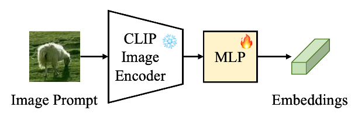

## YOLO-World-V2.1 Update Blog

**Contribtor:** [Tianheng Cheng](https://github.com/wondervictor), [Haokun Lin](https://felixmessi.github.io/), and [Yixiao Ge](https://geyixiao.com/).\
**Date:** 2025.02.05\
**Note:** Yixiao Ge is the project leader.

### Summary
Hey guys, long time no see. Recently, we've made a series of updates to YOLO-World, including improvements of the pre-trained models, and we've also fully released the training code for YOLO-World Image Prompts. We will continue to optimize YOLO-World in the future.

### Technical Details

We made some detailed optimizations to YOLO-World overall and updated the training for different model sizes from S to X. Specifically, we implemented the following technical updates:

**1. Fixed Padding**

In previous versions, we trained the model with vocabulary size 80. For samples with fewer than 80 words, we added padding (`" "`) to fill the vocabulary to enable training optimization. Typically, we would add masks to ignore the padding's influence. However, our experiments revealed that not masking the padding brought some "significant" benefits, including:
(1) Overall accuracy improvement (approximately 2~3 LVIS AP)
(2) Better detection capability for open-vocabulary categories\
This is perhaps a counter-intuitive feature, but we have continued using this setting to enhance the model's recognition ability for open-vocabulary objects. According to our analysis, padding can serve as background embeddings and play a role in the text-to-image module (T-CSPLayer), strengthening the representation of open-vocabulary features.

However, this introduced a significant issue. During usage, we typically need to add extra padding (`" "`) to obtain reasonable results from the model. Yet, adding padding can sometimes introduce uncertainties. Therefore, we aimed to optimize this issue in this version.

In previous versions, we introduced padding in both the T-CSPLayer used for text-to-image fusion and the classification loss. In this version, we implemented masks to ignore the impact of padding on classification loss, which has alleviated the aforementioned issues and brought further performance improvements.

Currently, users still need to consider padding (`" "`) in the input vocabulary. We will thoroughly optimize this in our upcoming work.

**2. Optimized Data Pipeline**

In previous versions, we used named entity extraction to annotate image-text data, such as CC3M. This approach introduced considerable noise and resulted in sparse image annotations, leading to low image utilization. To address this, we employed RAM++ for image tag annotation and combined [RAM++](https://github.com/xinyu1205/recognize-anything) annotations with extracted named entities to form the annotation vocabulary. Additionally, we used the YOLO-World-X-v2 model for annotation, generating an equal amount of 250k data samples.

**3. YOLO-World-Image: Image Prompts**

*Image Prompt:*
We've noticed that many users are very interested in using image prompts with YOLO-World. Previously, we provided a [preview version](https://huggingface.co/spaces/wondervictor/YOLO-World-Image). Therefore, in this update, we will provide a detailed introduction to the Image Prompt model and its training process.

*Image Prompt Adapter:*
YOLO-World uses CLIP-Text as the text encoder to encode text prompts into text embeddings. Since CLIP's pre-training has aligned the text and visual encoders, it naturally follows that we can directly use CLIP's visual encoder to encode image prompts into corresponding image embeddings, replacing text embeddings to achieve object detection with image prompts.
After obtaining the image embeddings, all subsequent steps remain identical to those in YOLO-World with text embeddings, including the text-to-image T-CSPLayer.

*Prompt Adapter:* While this approach is feasible, its actual performance is relatively mediocre. This can be attributed to the fact that CLIP's visual and textual alignments only exist at the contrastive level, making direct substitution ineffective.
To this end, we introduced a simple adapter, consisting of a straightforward MLP, to further align the visual prompt embeddings with text embeddings, as shown in the below figure.

*Training:* Taking the COCO dataset as an example, for each existing category in each image, we randomly select a **query bbox** and crop out the corresponding image region. We then use the CLIP Image Encoder with a MLP-Adapter to extract the corresponding **image embeddings**.

Subsequently, the image embeddings corresponding to different category query boxes will replace text embeddings in forward computation. 
For non-existent categories, we continue to use their text embeddings, which helps achieve alignment between image prompts and text prompts.
Objects are matched to their respective query boxes based on categories (where one of the ground truth bboxes of the same category is sampled as a query bbox). Then, the loss is calculated to optimize the adapter's parameters.

*Evaluation:* For each category in the training set, we randomly selected 32 object bounding box samples (with area > 100*100) and extracted their corresponding CLIP Image embeddings. We then calculated the average embeddings for each category as input, which, after passing through the adapter, replaced the text embeddings for network forward inference. Finally, we conducted testing following COCO's default evaluation protocol.

### Zero-shot Evaluation Results for Pre-trained Models
We evaluate all YOLO-World-V2.1 models on LVIS, LVIS-mini, and COCO in the zero-shot manner.

<table>
    <tr>
        <th rowspan="2">Model</th><th rowspan="2">Resolution</th><th colspan="4" style="border-right: 1px solid">LVIS AP</th><th colspan="4">LVIS-mini</th><th colspan="4" style="border-left: 1px solid">COCO</th>
    </tr>
        <td>AP</td><td>APr</td><td>APc</td><td style="border-right: 1px solid">APf</td><td>AP</td><td>APr</td><td>APc</td><td>APf</td><td style="border-left: 1px solid">AP</td><td>AP50</td><td>AP75</td>
    <tr style="border-top: 2px solid">
        <td>YOLO-World-S</td><td>640</td><td>18.5+1.2</td><td>12.6</td><td>15.8</td><td style="border-right: 1px solid">24.1</td><td>23.6+0.9</td><td>16.4</td><td>21.5</td><td>26.6</td><td style="border-left: 1px solid">36.6</td><td>51.0</td><td>39.7</td>
    </tr>
    <tr>
        <td>YOLO-World-S</td><td>1280</td><td>19.7+0.9</td><td>13.5</td><td>16.3</td><td style="border-right: 1px solid">26.3</td><td>25.5+1.4</td><td>19.1</td><td>22.6</td><td>29.3</td><td style="border-left: 1px solid">38.2</td><td>54.2</td><td>41.6</td>
    </tr>
    <tr style="border-top: 2px solid">
        <td>YOLO-World-M</td><td>640</td><td>24.1+0.6</td><td>16.9</td><td>21.1</td><td style="border-right: 1px solid">30.6</td><td>30.6+0.6</td><td>19.7</td><td>29.0</td><td>34.1</td><td style="border-left: 1px solid">43.0</td><td>58.6</td><td>46.7</td>
    </tr>
    <tr>
        <td>YOLO-World-M</td><td>1280</td><td>26.0+0.7</td><td>19.9</td><td>22.5</td><td style="border-right: 1px solid">32.7</td><td>32.7+1.1</td><td>24.4</td><td>30.2</td><td>36.4</td><td style="border-left: 1px solid">43.8</td><td>60.3</td><td>47.7</td>
    </tr>
    <tr style="border-top: 2px solid">
        <td>YOLO-World-L</td><td>640</td><td>26.8+0.7</td><td>19.8</td><td>23.6</td><td style="border-right: 1px solid">33.4</td><td>33.8+0.9</td><td>24.5</td><td>32.3</td><td>36.8</td><td style="border-left: 1px solid">44.9</td><td>60.4</td><td>48.9</td>
    </tr>
    <tr>
        <td>YOLO-World-L</td><td>800</td><td>28.3</td><td>22.5</td><td>24.4</td><td style="border-right: 1px solid">35.1</td><td>35.2</td><td>27.8</td><td>32.6</td><td>38.8</td><td style="border-left: 1px solid">47.4</td><td>63.3</td><td>51.8</td>
    </tr>
    <tr>
        <td>YOLO-World-L</td><td>1280</td><td>28.7+1.1</td><td>22.9</td><td>24.9</td><td style="border-right: 1px solid">35.4</td><td>35.5+1.2</td><td>24.4</td><td>34.0</td><td>38.8</td><td style="border-left: 1px solid">46.0</td><td>62.5</td><td>50.0</td>
    </tr>
    <tr style="border-top: 2px solid">
        <td>YOLO-World-X</td><td>640</td><td>28.6+0.2</td><td>22.0</td><td>25.6</td><td style="border-right: 1px solid">34.9</td><td>35.8+0.4</td><td>31.0</td><td>33.7</td><td>38.5</td><td style="border-left: 1px solid">46.7</td><td>62.5</td><td>51.0</td>
    </tr>
    <tr>
        <td colspan="13">YOLO-World-X-1280 is coming soon.</td>
    </tr>
</table>

### Model Card

<table>
    <tr>
        <th>Model</th><th>Resolution</th><th>Training</th><th>Data</th><th>Model Weights</th>
    </tr>
    <tr style="border-top: 2px solid">
        <td>YOLO-World-S</td><td>640</td><td>PT (100e)</td><td>O365v1+GoldG+CC-LiteV2</td><td><a href="https://huggingface.co/wondervictor/YOLO-World-V2.1/resolve/main/x_stage1-62b674ad.pth"> 🤗 HuggingFace</a></td>
    </tr>
    <tr>
        <td>YOLO-World-S</td><td>1280</td><td>CPT (40e)</td><td>O365v1+GoldG+CC-LiteV2</td><td><a href="https://huggingface.co/wondervictor/YOLO-World-V2.1/resolve/main/s_stage2-4466ab94.pth"> 🤗 HuggingFace</a></td>
    </tr>
    <tr style="border-top: 2px solid">
        <td>YOLO-World-M</td><td>640</td><td>PT (100e)</td><td>O365v1+GoldG+CC-LiteV2</td><td><a href="https://huggingface.co/wondervictor/YOLO-World-V2.1/resolve/main/m_stage1-7e1e5299.pth"> 🤗 HuggingFace</a></td>
    </tr>
    <tr>
        <td>YOLO-World-M</td><td>1280</td><td>CPT (40e)</td><td>O365v1+GoldG+CC-LiteV2</td><td><a href="https://huggingface.co/wondervictor/YOLO-World-V2.1/resolve/main/m_stage2-9987dcb1.pth"> 🤗 HuggingFace</a></td>
    </tr>
    <tr style="border-top: 2px solid">
        <td>YOLO-World-L</td><td>640</td><td>PT (100e)</td><td>O365v1+GoldG+CC-LiteV2</td><td><a href="https://huggingface.co/wondervictor/YOLO-World-V2.1/resolve/main/l_stage1-7d280586.pth"> 🤗 HuggingFace</a></td>
    </tr>
    <tr>
        <td>YOLO-World-L</td><td>800 / 1280</td><td>CPT (40e)</td><td>O365v1+GoldG+CC-LiteV2</td><td><a href="https://huggingface.co/wondervictor/YOLO-World-V2.1/resolve/main/l_stage2-b3e3dc3f.pth"> 🤗 HuggingFace</a></td>
    </tr>
    <tr style="border-top: 2px solid">
        <td>YOLO-World-X</td><td>640</td><td>PT (100e)</td><td>O365v1+GoldG+CC-LiteV2</td><td><a href="https://huggingface.co/wondervictor/YOLO-World-V2.1/resolve/main/x_stage1-62b674ad.pth"> 🤗 HuggingFace</a></td>
    </tr>
</table>

**Notes:**
* PT: Pre-training, CPT: continuing pre-training
* CC-LiteV2: the newly-annotated CC3M subset, including 250k images.

